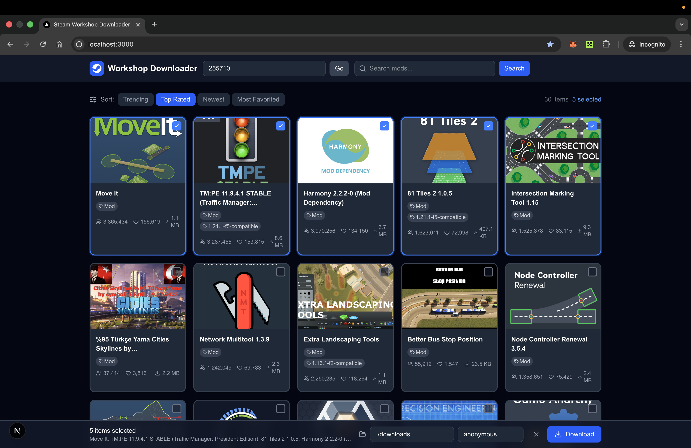
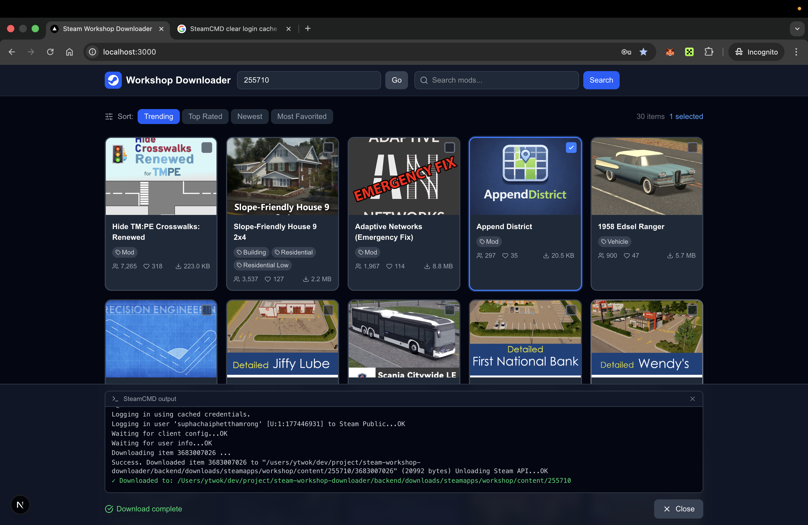

# Steam Workshop Downloader

Browse and download Steam Workshop mods via a web UI or CLI.

```
steam-workshop-downloader/
├── backend/    Python API server + CLI (FastAPI + Click)
└── frontend/   Web UI (Next.js)
```

---

## Screenshots

**Select mods to download**



**Live download with SteamCMD output**



---

## Requirements

- Python 3.10+
- Node.js 18+
- [SteamCMD](https://developer.valvesoftware.com/wiki/SteamCMD) — required for downloading mods

### Install SteamCMD (macOS)

```bash
brew install steamcmd
# runs as steamcmd.sh
```

### Install SteamCMD (Linux)

```bash
# Ubuntu/Debian
sudo apt install steamcmd
```

---

## Quick Start

```bash
make install   # install backend + frontend dependencies
make dev       # run both servers in parallel
```

Then open [http://localhost:3000](http://localhost:3000).

---

## Setup (manual)

### Backend

```bash
cd backend
python3 -m venv .venv
source .venv/bin/activate
pip install -e .
python serve.py
# API server starts at http://localhost:8000
```

### Frontend

```bash
cd frontend
npm install
npm run dev
# Opens at http://localhost:3000
```

### Optional: Steam API key

Set `STEAM_API_KEY` for richer browse metadata (no scraping):

```bash
export STEAM_API_KEY=your_key_here
python serve.py
```

Get a free key at https://steamcommunity.com/dev/apikey

---

## Web UI Usage

1. Enter an **App ID** or paste a Steam Workshop URL in the header
   - Default is `255710` (Cities: Skylines)
   - Also accepts full URLs like `https://steamcommunity.com/app/255710/workshop/`
2. Browse and sort mods — click cards to select them
3. Paste a `filedetails` URL or workshop ID directly into the search bar to look up a specific mod
4. Enter your **Steam username** in the download bar (leave blank for anonymous / F2P games)
5. Click **Download**

**Login flow:**
- If you have a cached SteamCMD session, login is automatic — no password needed
- If no cache exists, a **password prompt** appears automatically
- If your account uses **Steam Guard / 2FA**, a code prompt appears after login

Downloaded files are saved to:
```
<output_dir>/steamapps/workshop/content/<app_id>/<workshop_id>/
```

---

## CLI Usage

```bash
cd backend
source .venv/bin/activate
```

### Browse workshop

```bash
swdl browse 255710
swdl browse 255710 --sort new --count 10
swdl browse 255710 --search "road"
swdl browse "https://steamcommunity.com/app/255710/workshop/"
```

Sort options: `trend` (default), `top`, `new`, `favorites`

### Get item info

```bash
swdl info 123456789
swdl info "https://steamcommunity.com/sharedfiles/filedetails/?id=123456789"
```

### Download mods

```bash
# Single mod (anonymous login, for F2P games)
swdl download 123456789 -a 255710

# Multiple mods
swdl download 123456789 987654321 -a 255710

# With your Steam account (required for paid games)
swdl download 123456789 -a 255710 -u your_steam_username

# Custom output directory
swdl download 123456789 -a 255710 -o ~/mods
```

### Check SteamCMD

```bash
swdl check
```

---

## Make Commands

| Command | Description |
|---------|-------------|
| `make install` | Install backend + frontend dependencies |
| `make dev` | Run both servers in parallel |
| `make backend` | Run backend only |
| `make frontend` | Run frontend only |
| `make build` | Production build of frontend |
| `make clean` | Remove all generated files |

---

## API Endpoints

| Method | Path | Description |
|--------|------|-------------|
| `GET` | `/api/browse` | Browse workshop items |
| `GET` | `/api/item/{id}` | Get single item details |
| `POST` | `/api/download/stream` | Stream download output via SSE |
| `POST` | `/api/download/input` | Send password or Steam Guard code |
| `GET` | `/api/status` | Check SteamCMD + API key status |

### Browse params

| Param | Default | Description |
|-------|---------|-------------|
| `app_id` | required | Steam App ID |
| `sort` | `trend` | `trend`, `top`, `new`, `favorites` |
| `page` | `1` | Page number |
| `count` | `20` | Items per page (max 50) |
| `search` | `""` | Search query |
